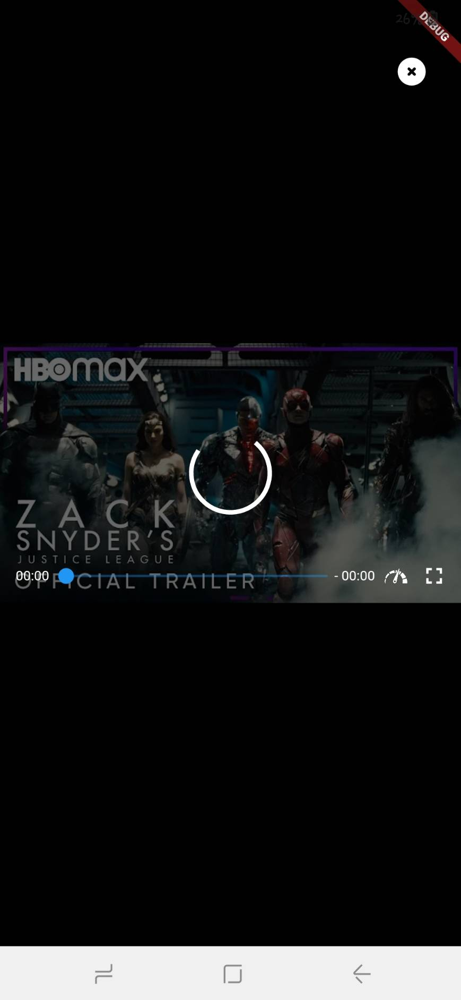

# MOVIEZ 🎬🎞
This app is a movie app which provides informations and trailers about movies.

## Features
* Movies
* Detail movies 
* Discover
* Genre movies
* Help
* About us
* Search movies

## Team Members :busts_in_silhouette: 

### Code                            
Name | NIM
-----|-----
Adela Tania | 535190006
Cordellya Agatha | 535190014
David Jansen | 535190038

### Design
Name | NIM
-----|-----
Valentino Puendra | 535190011
Caroline Wili Harto | 535190032

## Previews App 📸

### Welcome screen
<pre>
  
</pre>

### Home screen
<pre>
     
</pre>

### Detail screen
<pre>
   
</pre>

### Help and About Us screen
<pre>
  
</pre>

### Search
<pre>
  
</pre>

## Disclaimer :warning:

This web is for educational purposes only

